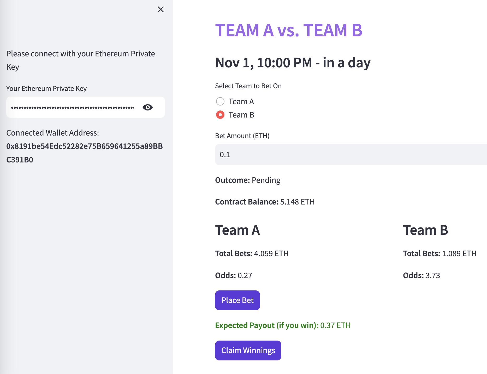

# README

## Solidity Smart Contract -- Prediction.Sol

The smart contract is designed to handle betting on two outcomes (Team A and Team B). Its versatile design enables applicability to any event characterized by binary outcomes—be it coin flips, sporting events, stock market fluctuations, and the like. The admin can open or close betting, decide the outcome of the bet based on real world result, and, if necessary (such as in the event of a game suspension), withdraw funds from the contract. Players can place bets, and claim their winnings once the outcome is decided.

### Main Functions

- `toggleBetting(true for open)`: Admin can open or close betting.
- `placeBet(true for TeamA)`: Place a bet on Team A or Team B. The function is payable, meaning it requires sending ETH along with the transaction.
- `withdraw(uint256 amount)`: Admin can withdraw ETH from the contract.
- `decideOutcome(true for teamA Won)`: Admin can decide the outcome of the bet.
- `claimWinnings()`: Players can claim their winnings based on the outcome and their bet.

### View Functions
- `getTotalBets()`: View function to get the total bets placed on Team A and Team B.
- `getBetDetails(address bettor)`: View function to get the bet details of a specific player.
- `getOutcome()`: View function to get the current outcome of the bet.
- `getAdmins()`: View function to get the admin and fee recipient addresses.

## Front-End Interface (For Player) -- Prediction.py

The interface, designed with user-friendliness in mind, empowers players to seamlessly connect their Ethereum wallets, place bets, and review the betting outcomes. 

### Features

- Wallet connection using Ethereum private key.
- Betting on Team A or Team B.
- Display of current outcome, total bets, and calculated odds.
- Input for bet amount and submission of the bet.
- Show the expected payout if win.
- Claiming of wining.

## Installation and Usage

1. Clone the repository to your local machine.
2. Navigate to the project directory and install the required dependencies: `pip install streamlit web3==5.23.0`
3. Deploy the smart contract to your preferred Ethereum network and note down the contract address.
4. Update the `contract_address` variable in the Streamlit code with the deployed contract address.
5. Run the Streamlit app: `streamlit run prediction.py`
6. Your web browser will be opened to interact with the platform.
